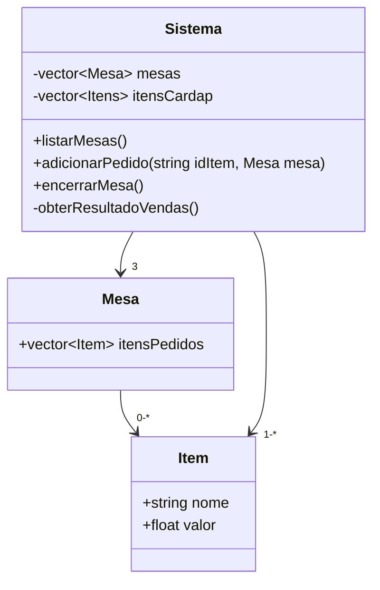

```mermaid
classDiagram
    Sistema --> "3" Mesa
    Mesa --> "0-*" Item
    Sistema --> "1-*" Item

    class Item {
        +string nome
        +float valor
    }

    class Mesa {
      +vector~Item~ itensPedidos
    }

    class Sistema {
        -vector~Mesa~ mesas
        -vector~Itens~ itensCardap
        
        +listarMesas()
        +adicionarPedido(string idItem, Mesa mesa)
        +encerrarMesa()
        -obterResultadoVendas()
    }
```